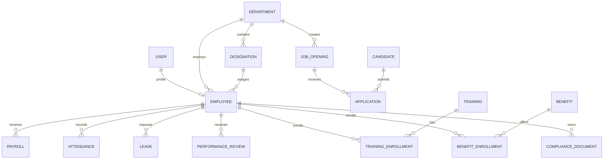

# HRGenius ER Summary

```mermaid
erDiagram
    USER ||--o| EMPLOYEE : profile
    DEPARTMENT ||--o{ DESIGNATION : contains
    DEPARTMENT ||--o{ EMPLOYEE : employs
    DESIGNATION ||--o{ EMPLOYEE : assigns
    EMPLOYEE ||--o{ PAYROLL : receives
    EMPLOYEE ||--o{ ATTENDANCE : records
    EMPLOYEE ||--o{ LEAVE : requests
    EMPLOYEE ||--o{ PERFORMANCE_REVIEW : receives
    EMPLOYEE ||--o{ TRAINING_ENROLLMENT : enrolls
    EMPLOYEE ||--o{ BENEFIT_ENROLLMENT : enrolls
    EMPLOYEE ||--o{ COMPLIANCE_DOCUMENT : owns
    DEPARTMENT ||--o{ JOB_OPENING : creates
    JOB_OPENING ||--o{ APPLICATION : receives
    CANDIDATE ||--o{ APPLICATION : submits
    TRAINING ||--o{ TRAINING_ENROLLMENT : has
    BENEFIT ||--o{ BENEFIT_ENROLLMENT : offers
```

The Django migrations are the primary schema mechanism. SQL files are synchronized reference artifacts.
